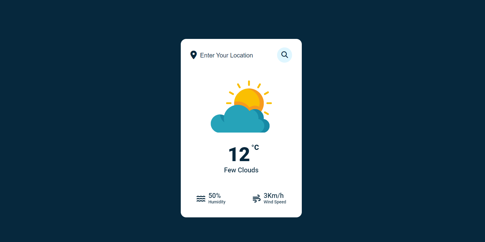

# Weather - Codestone

This is a simple weather application built with HTML, CSS and JavaScript.

## How to use

To use this weather application, simply enter your location in the search box and click the magnifying glass icon. The application will display the current weather conditions for your location.

## Features

- Real-time weather updates
- Temperature display in Celsius
- Humidity and wind speed information
- Easy-to-use search box

## More
 
- Weather link (api): https://openweathermap.org/
- Icon link: https://fontawesome.com/icons

## Contact

If you have any questions or issues with this weather application, please contact us at phamdat04052003@gmail.com.

